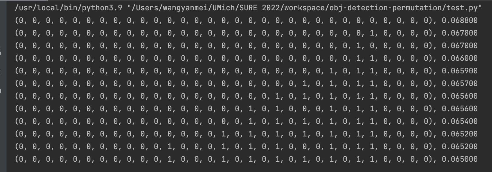

# Object Detection Permutation

A tool that generates all permutation of device assignment for an object detection network, and test the performance of it using a simulator (v3).

## How to use & Heuristics (Yolov4)

It is not feasible to perform a complete brute-force search (complexity 2^81). To reduce runtime, apply the following methods. 

###1 . Independent partial optimal

Yolov4 has several repeated/similar structures that does not influence the later layers. Therefore, run this tool on those structures separately, and record the optimal solution. Later, just use those solutions in the complete network.

### 2. Sequential structures simplification

There is no need to shift data between devices during a chain-like sequential structure. Therefore I assume they are on one device.

### 3. Re-run with previous partial result

Tool feadback screenshot: #device = 2, bandwidth = 1280Mbps
This image is the feedback after half an hour, progress < 0.5%

As shown in the image above, while the optimal for the whole network has not been reached, the device assignment strategy for the last several layers is fixed. Re-run the tool with those fixed assignment, and it is assumed that optimal is found. 